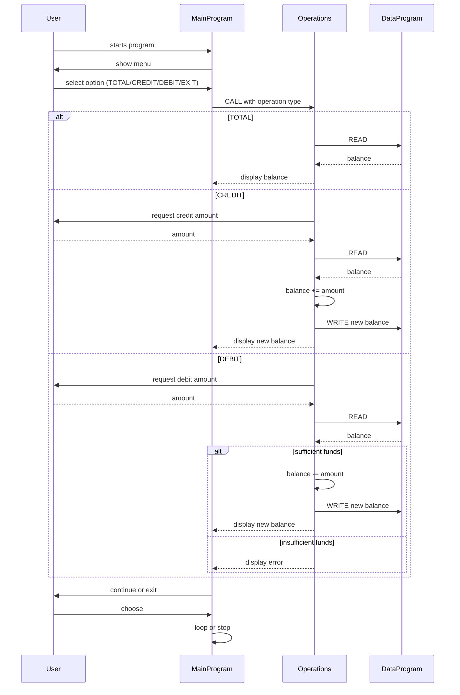

# 项目文档

该项目演示了一个遗留 COBOL 账户管理系统，重点关注学生账户行为。项目包含三个 COBOL 程序，协同实现基于菜单的查询余额、充值、扣款功能。

## 文件与用途

- `src/cobol/main.cob` (`MainProgram`)
  - 交互式用户输入的入口。
  - 显示菜单选项：查看余额、存入金额、支出金额、退出。
  - 根据用户选择调用 `Operations`，传递参数 `TOTAL`、`CREDIT` 或 `DEBIT`。

- `src/cobol/operations.cob` (`Operations`)
  - 负责每种操作类型的业务逻辑。
  - `TOTAL`：读取当前余额并显示。
  - `CREDIT`：输入金额，读取余额，加上金额，写回新余额并显示。
  - `DEBIT`：输入金额，读取余额，检查是否足够，足够则扣除并写回新余额，否则提示余额不足。
  - 通过调用 `DataProgram` 实现余额持久化访问。

- `src/cobol/data.cob` (`DataProgram`)
  - 模拟账户余额的数据存取。
  - 在工作存储中保持 `STORAGE-BALANCE`（初始值 `1000.00`）。
  - 通过参数 `OPERATION-TYPE` 提供 `READ` 和 `WRITE` 功能。

## 关键功能和流程

1. 用户在 `MainProgram` 中与主菜单交互。
2. `MainProgram` 将用户选项路由到 `Operations`：
   - `TOTAL` → 显示当前余额
   - `CREDIT` → 读取金额、增加、更新余额
   - `DEBIT` → 读取金额、校验余额、扣减并更新（或拒绝）
3. `Operations` 调用 `DataProgram`：
   - `READ` 返回当前余额
   - `WRITE` 保存更新后的余额

## 学生账户业务规则

- 初始余额为 `1000.00`。
- 当请求扣款金额大于当前余额时，禁止扣款，避免账户负余额。
- 充值和扣款金额使用定点数（`PIC 9(6)V99`）。
- 余额通过 `DataProgram` 的状态在运行时保持。
- 用户选择无效菜单项时提示重新选择，不进行余额更改。

## 备注

- 该简单示例中，学生仅使用单一账户表示，没有学生标识符。
- 如果要支持多学生账户，需要引入外部文件/数据库记录，并添加学生ID输入。

## 时序图（Mermaid）

